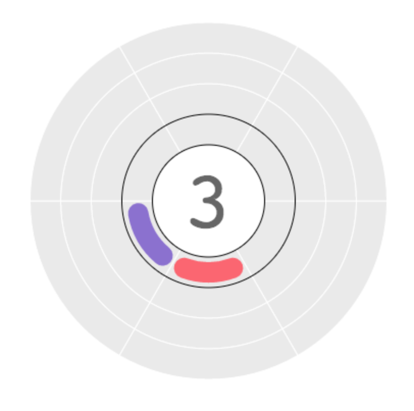
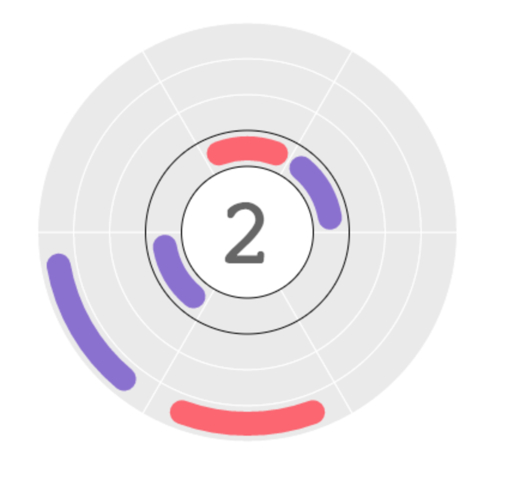
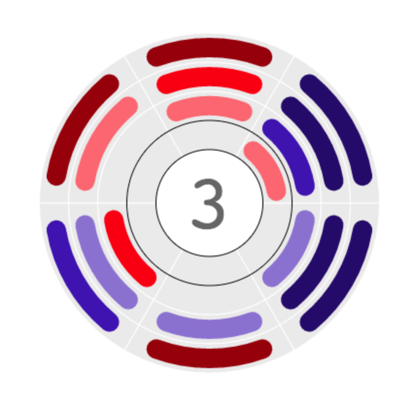
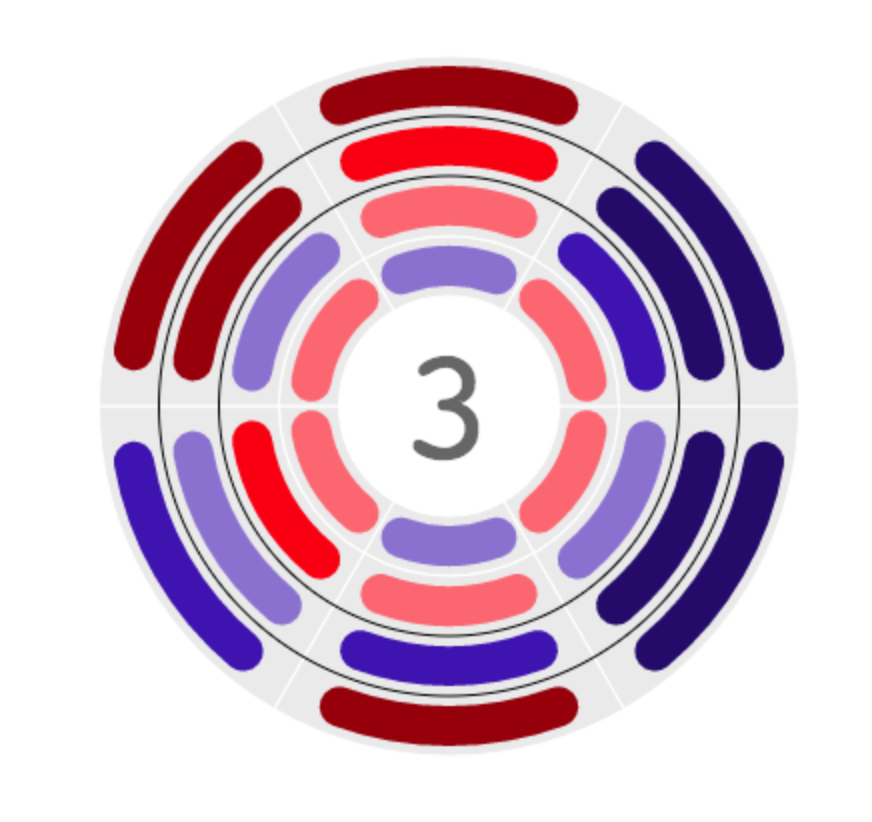
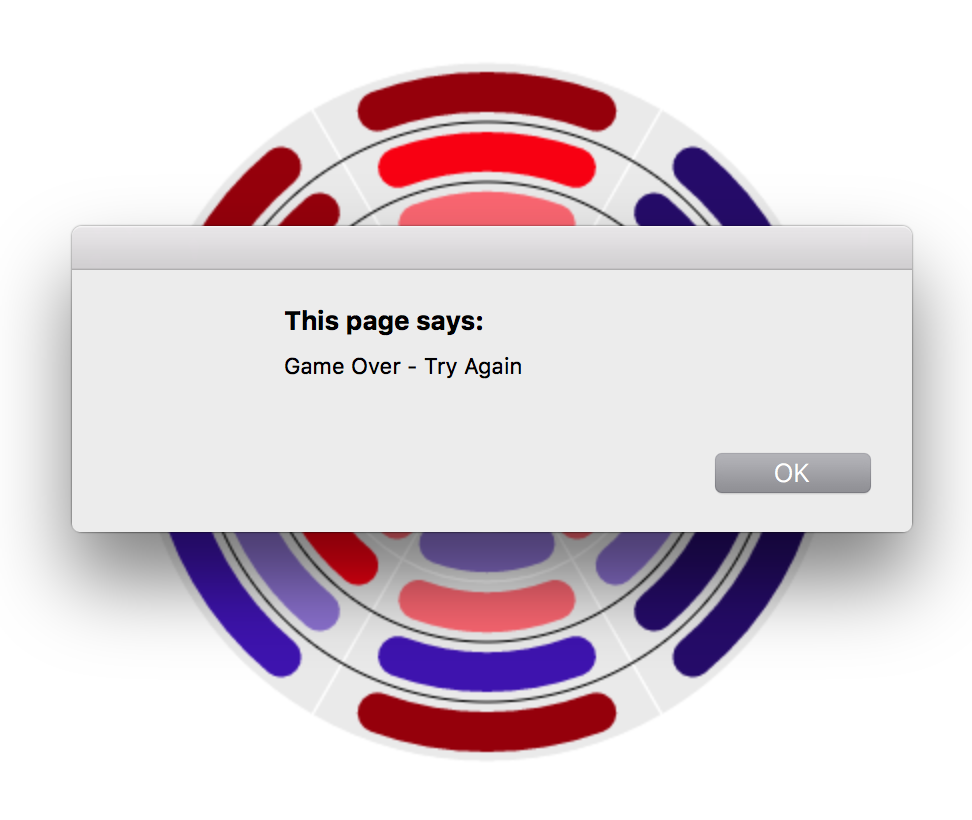

# Arc Bloom
The main point behind this game was a fluid-feeling simple game like 2048. The main functionality of the game is in place but the surrounding infrustructure is missing.

This game was supposed to be a short and fun side-project, but I started my Masters shortly after this project and lost track of what I was doing. I may pick this side-project back up at some point.

Here are some pictures of the game:

